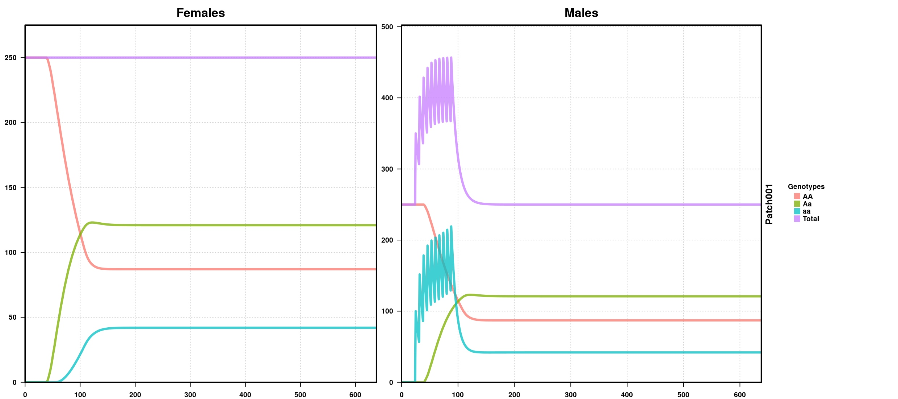
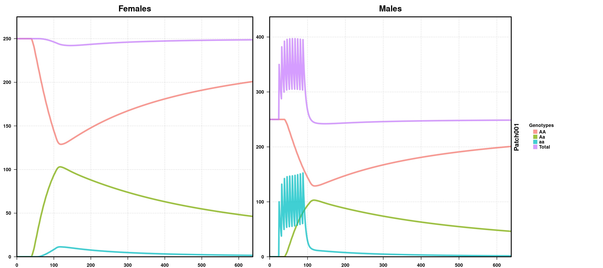
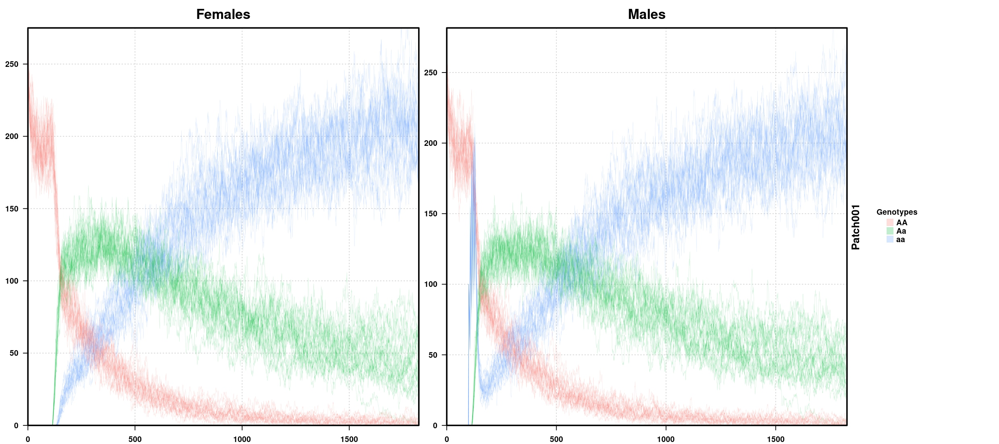
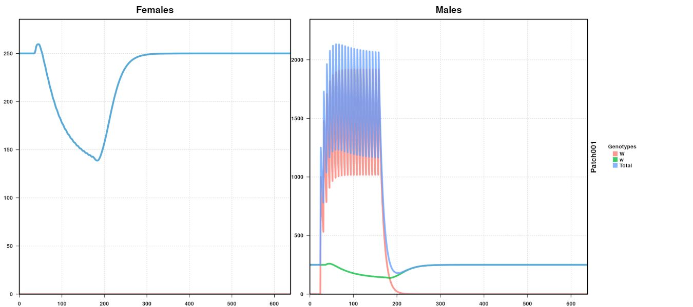
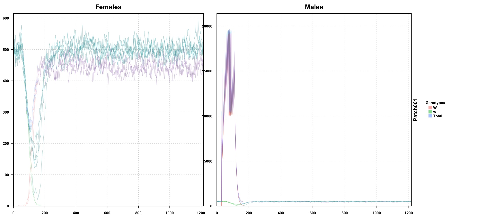

# Basic Simulations

In these first tutorials, we will go through the basics of setting up and running simulations in MGDrivE.

## Mendelian Inheritance

Our first cases will involve running MGDrivE on Mendelian inheritance baselines with, and without fitness costs on specific allelic combinations. Through these examples we will learn how to setup an MGDrivE simulation with its components and how to include releases of genetic variants into the simulated populations.

Deterministic simulations work fine to get a sense of the general response of the biological system, but the underlying processes involved in the inheritance processes are better encapsulated by stochastic simulations. In this use-case we will run mendelian inheritance releases of an allele with an increased mortality rate as compared to the wild population.

## Wolbachia

Finally, we will simulate incompatible-insect-techique (IIT) releases for population suppression through cytoplasmic incompatibility ([Beebe et al. 2021](https://www.pnas.org/doi/10.1073/pnas.2106828118)):

**Note:** click on the images to be directed to the code that generated them.