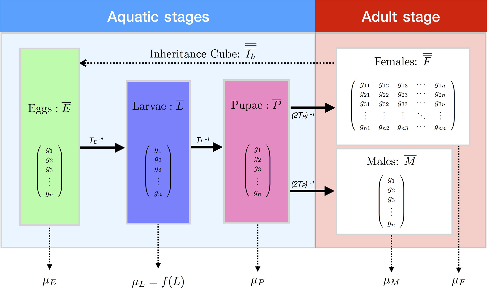
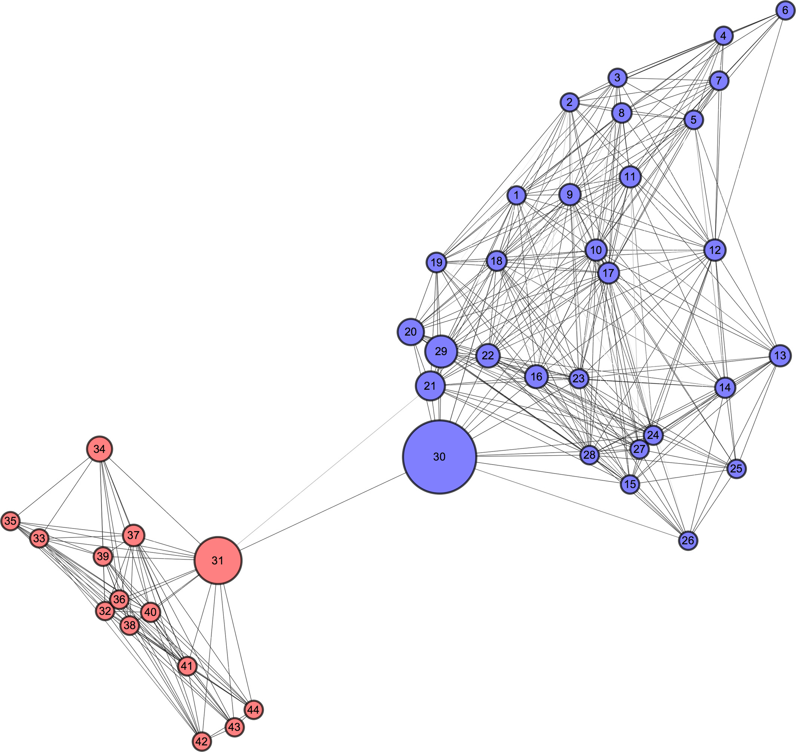

# Introduction to MGDrivE

Our software package "Mosquito Gene Drive Explorer" is an [R package](https://cran.r-project.org/web/packages/MGDrivE/index.html) that is capable of simulating the inheritance of genetic constructs in complex heterogeneous landscapes.
## Modules

MGDrivE is structured in three main modules:

* [Life-History](#life-history) deals with the life-stages that mosquitoes go through in their development (egg, larva, pupa, and adults)
* [Inheritance](#inheritance) controls the way genes get inherited from parents to offspring
* [Landscape](#landscape) determines the setting in which individuals will develop and migrate

which connect to each other to generate our simulations.

### Life-History

MGDrivE's life-history structure is based on [Hancock and Godfray (2007)](https://malariajournal.biomedcentral.com/articles/10.1186/1475-2875-6-98), with extended structures to accommodate an arbitrary number of genotypes throughout the development of simulated mosquitos. In essence, the original release of MGDrivE can be thought of as vector-based version of the lumped age-class model where the new dimensions store the genotype information of the population at each life-stage. The two main "behavioral phases" that are implemented in or framework are:

* **Aquatic Stages:** Individuals go through three aquatic stages: egg, larva, and pupa; with the density-dependence taking place in the larval stage.
* **Adult Stages:** Male individuals are counted and aggregated by their genotypes, whereas female adults store both their genotype and the genotype of the male they mated with.

### Inheritance

One of MGDrivE's main contributions is its ability to handle arbitrary inheritance patterns so that a wide variety of genetic constructs can be simulated and studied. Some examples of drives that are included with the base version of our software are: [Linked-Drive](https://github.com/MarshallLab/MGDrivE/blob/master/MGDrivE/R/Cube-CRISPR2MF.R), [Split-Drive](https://github.com/MarshallLab/MGDrivE/blob/master/MGDrivE/R/Cube-SplitDrive.R), [RIDL](https://github.com/MarshallLab/MGDrivE/blob/master/MGDrivE/R/Cube-RIDL.R), [MEDEA](https://github.com/MarshallLab/MGDrivE/blob/master/MGDrivE/R/Cube-MEDEA.R), [Reciprocal Chromosomal Translocations](https://github.com/MarshallLab/MGDrivE/blob/master/MGDrivE/R/Cube-RecTrans.R), [Trans-Complementing Gene Drive](https://github.com/MarshallLab/MGDrivE/blob/master/MGDrivE/R/Cube-tGD.R), [Maternal-Toxin/Zygotic-Antidote System](https://github.com/MarshallLab/MGDrivE/blob/master/MGDrivE/R/Cube-1LocusTA.R).

**Inheritance patterns**

Arguably the most important component in our package is the "inheritance cube". It is within this structure that the genetic inheritance is defined and stored. The simplest way to think about this object is a 3D matrix in which we have the female parent's genotype on one axis, the male's parent's genotype in the second axis, and the offspring's inherited genotypes in the remaining one (as probabilities). For example, an entry of the matrix defined as: `['HH', 'WW', 'HH'] = 1` would mean that given that if the female and male parents have `HW` and `WW` genotypes respectively, the result will always be offspring with a `HH` genotypic combination. Following this example, `['HW', 'WW', 'HH'] = .5` with `['HW', 'WW', 'WH'] = .5` would make half the offspring `HH` and the other half `WH`. This is a fairly unrealistic example, but it highlights the way we represent the inheritance process in our simulations. Any arbitrary combination of genes and probabilities can be coded, as long as it is an $N^3$-dimensional structure where all the Z-axis entries add to 1 (so that they represent probabilities).

**Fitness costs**

Now, it's not that useful to have genotypic inheritance patterns if these genotypes do not map to phenotypic traits. To do this, we've added the following fitness costs (or increases):

* `s`: Genotype-specific fractional reduction (increase) in fertility
* `eta`: Genotype-specific mating fitness
* `phi`: Genotype-specific sex ratio at emergence
* `xiF`: Genotype-specific female pupatory success
* `xiM`: Genotype-specific male pupatory success
* `omega`: Genotype-specific multiplicative modifier of adult mortality
* `tau`: Inheritance-cube mask

### Landscape

Finally, the landscape can generally be thought of as a network of panmictic (fully-mixing) populations in which mosquitoes can migrate according to the distances and movement probabilities.

**Migration**

Individuals will generally move across the landscape based in a probability-network-based way. We can think of this network as a Markovian process in which mosquitoes randomly move from one place to another based on the probability defined by the node relative to the other nodes in the network:

**Batch Migration**

Additionally, MGDrivE accomodates for "batch migration" processes. These events take into account the scenario in which a group of mosquitoes can "travel" from one population to another without any distance relationship between the aforementioned nodes (to simulate cases in which mosquitoes can hitchhike in barges or trucks).