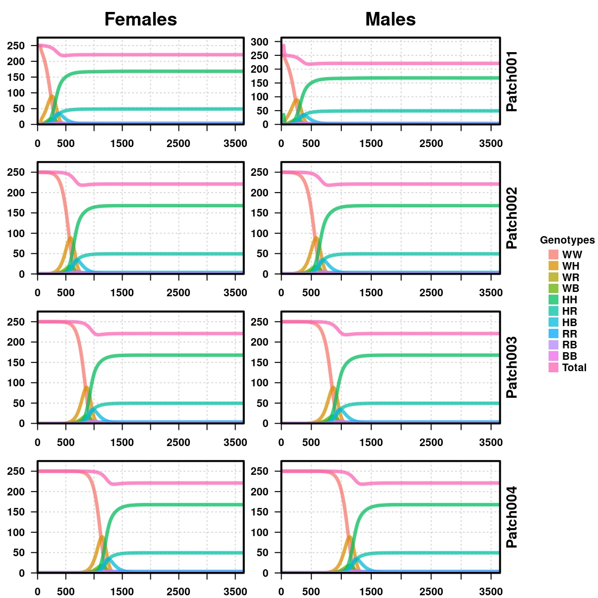
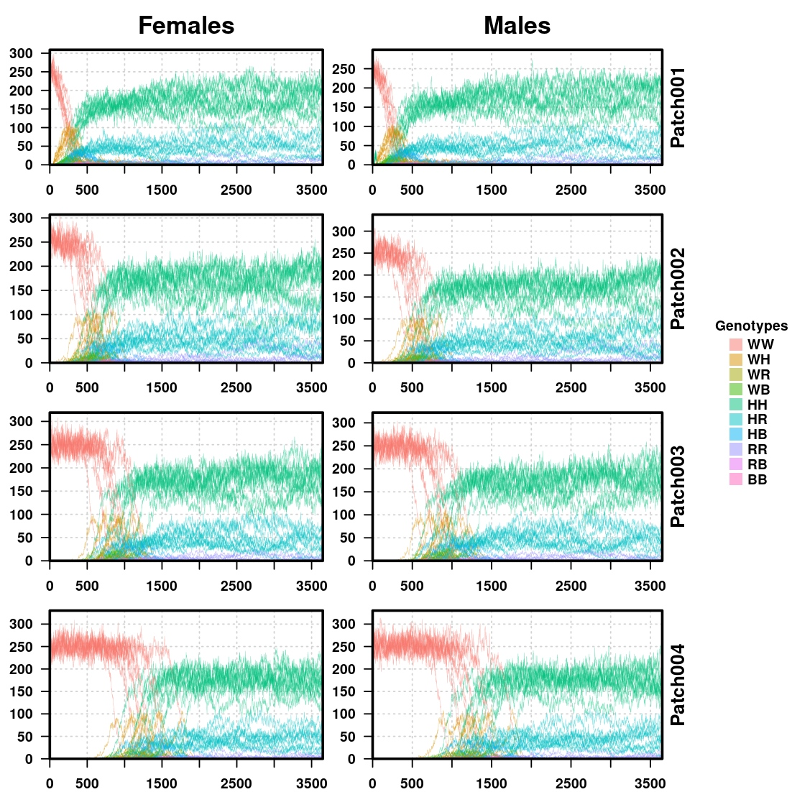
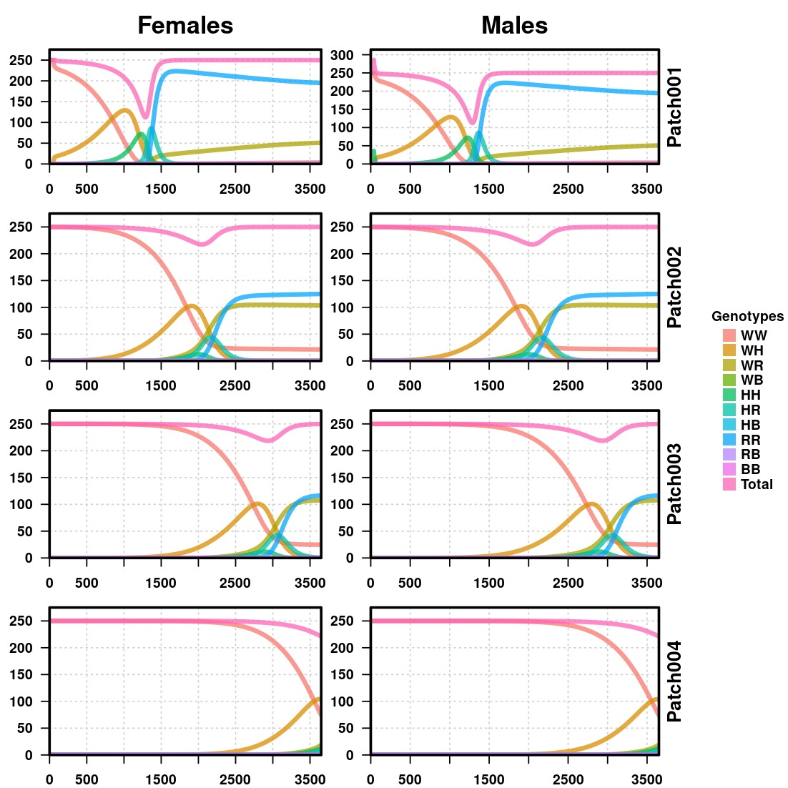
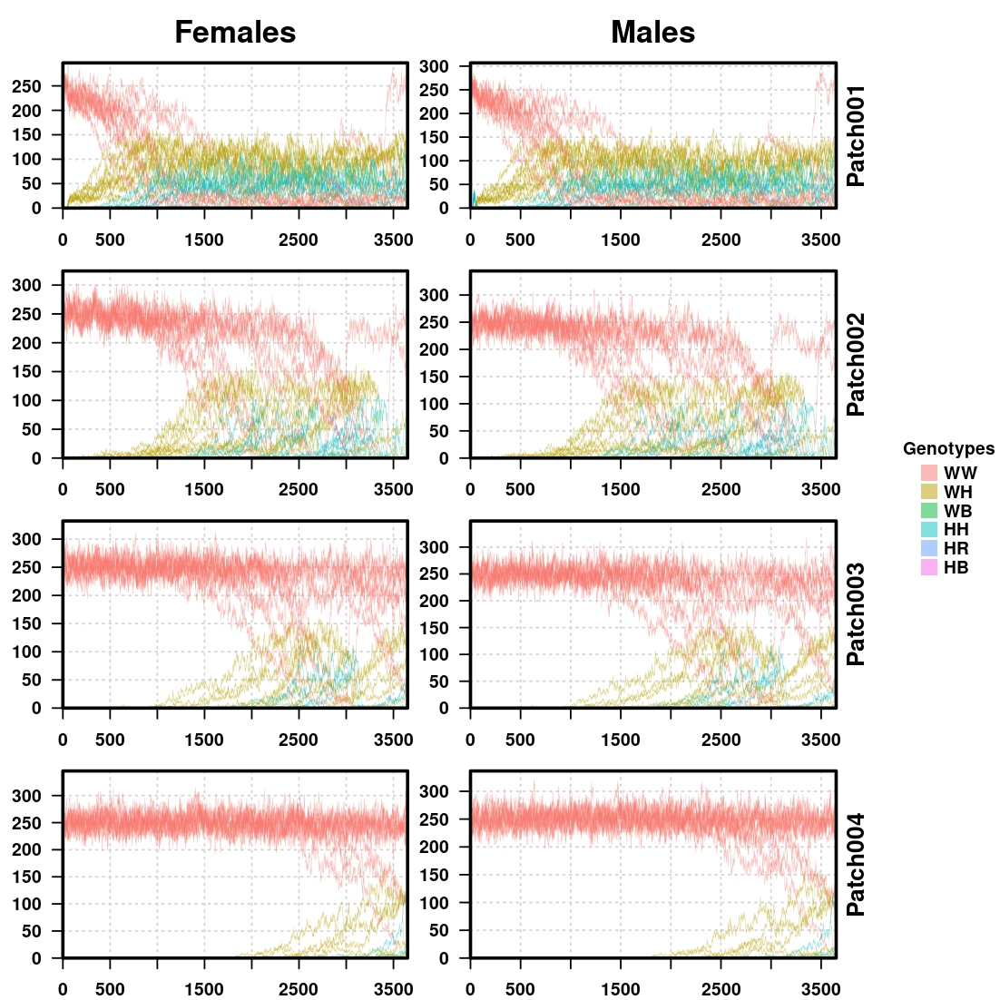

# Linked Drives

In these demos we will have a look at how a basic gene drive construct (as described [Gantz & Bier 2015](https://www.science.org/doi/10.1126/science.aaa5945)) spreads in a series of populations in a "ring" topology, for insect replacement and suppression applications.

## Replacement

Insect replacement technology revolves around the idea of shifting the presence of wild alleles in the current population to one in which the composition is mainly dominated by genotypic combinations that are less harmful (that are less able to transmit diseases, for example). 

## Suppression

Population suppression, on the other hand, revolves around the idea of conferring deleterious phenotypic traits to the driven genes so that they can eliminate the nocive species for the targeted environment.

**Note:** click on the images to be directed to the code that generated them.
